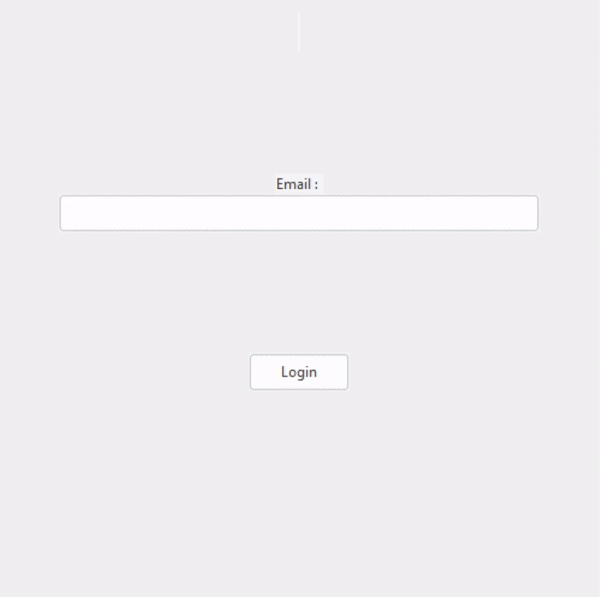

# Reddis-TinyURL

## Installation

install all python requirements :

```
$ pip install -r .\requirements.txt
```

## How to run

After making sure your redis server is running, you can start the program :

```
$ python main.py [host] [port]
```

By default, the host is <b>localhost</b> and the port is <b>6379</b>. Both arguments are thus optional.

## Demo


